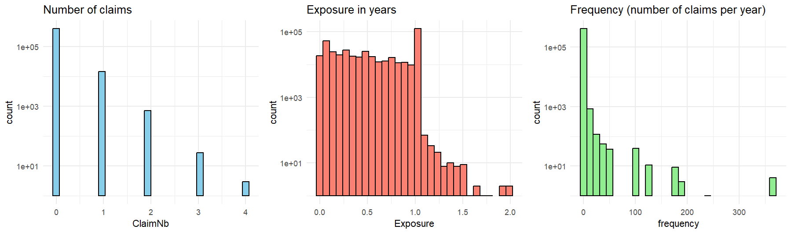

# 📊 **Insurance Data Analysis Project**

This project performs data analysis on insurance claims using **R**. The main objectives are to load and prepare the data, calculate key metrics (e.g., frequency of claims), and visualize the results through histograms.

---

### **1. Load and prepare data**

```r
# Import required libraries
library(readxl)    # Read Excel files
library(dplyr)     # Data manipulation
library(gridExtra) # Arrange multiple plots
library(ggplot2)   # Visualization

# Load Excel files
freq <- read_excel("data/freMTPLfreq.xlsx")
sev <- read_excel("data/freMTPLsev.xlsx")
valorisation <- read_excel("data/freMTPLsev.xlsx", sheet = 2)

# Merge datasets by 'PolicyID'
merged <- merge(freq, sev, by = "PolicyID")

# Convert 'PolicyID' to numeric and rename columns
freq$PolicyID <- as.numeric(freq$PolicyID)
colnames(valorisation)[1:3] <- c("year", "p", "index")
```

---

### **2. Data exploration**

```r
# Summarize and preview the data
summary(freq)
summary(sev)
summary(merged)
head(merged)
```

---

### **3. Data transformation**

```r
# Calculate claim frequency and adjust premiums based on exposure
freq$frequency <- freq$ClaimNb / freq$Exposure
sev$ClaimAmount_Exposition <- merged$ClaimAmount / merged$Exposure
freq$Prime_Ajustee <- freq$prime / freq$Exposure

# Weighted average frequency and zero-claim exposure fraction
average_frequency <- weighted.mean(freq$frequency, freq$Exposure)
cat("Average Frequency =", average_frequency, "\n")

fraction_zero_claims <- sum(freq$Exposure[freq$ClaimNb == 0]) / sum(freq$Exposure)
cat("Fraction of exposure with zero claims =", sprintf("%.1f%%", fraction_zero_claims * 100), "\n")
```
Fraction of exposure with zero claims = 95.3% 
---

### **4. Data visualization**

```r
# Plot 1: Histogram of number of claims
p1 <- ggplot(freq, aes(x = ClaimNb)) +
  geom_histogram(bins = 30, fill = "skyblue", color = "black") +
  scale_y_log10() +
  ggtitle("Number of claims") +
  theme_minimal()

# Plot 2: Histogram of exposure
p2 <- ggplot(freq, aes(x = Exposure)) +
  geom_histogram(bins = 30, fill = "salmon", color = "black") +
  scale_y_log10() +
  ggtitle("Exposure in years") +
  theme_minimal()

# Plot 3: Histogram of claim frequency
p3 <- ggplot(freq, aes(x = frequency)) +
  geom_histogram(bins = 30, fill = "lightgreen", color = "black") +
  scale_y_log10() +
  ggtitle("Frequency (number of claims per year)") +
  theme_minimal()

# Display all three plots side by side
grid.arrange(p1, p2, p3, ncol = 3)
```


---
### **5. Pure premium calculation and reinsurance analysis**

This part of the project calculates the **pure premium** and **S/P ratio** while simulating reinsurance statistics using the **Burning Cost method** for the year 2025.
---
```r
# Calculate the pure premium adjusted for exposure
sum_claimamount_aj <- sum(sev$ClaimAmount_Exposition)
sum_claimamount <- sum(sev$ClaimAmount)
Policy_number <- length(freq$PolicyID)
Prime_pure <- sum_claimamount_aj / Policy_number

# Example of pure premium without adjustment
print(paste("Equivalent days/year:", 365 * mean(freq$Exposure)))
```
"équivalent jour/ an : 204.797119867607"
```
Prime_pure_nonaj <- sum_claimamount / Policy_number
print(paste("Non-adjusted pure premium:", Prime_pure_nonaj, "Adjusted pure premium:", Prime_pure))
```
[1] "prime pure non ajustée : 83.4164155587665 Prime pure ajustée: 371.140298204758"
```
# Calculate the S/P ratio without adjusting for exposure duration (claims and premiums are time-matched)
sum_prime <- sum(freq$prime)
Ratio_SP <- sum_claimamount / sum_prime
print(paste("S/P Ratio:", Ratio_SP))
```
[1] "Ratio S/P : 0.540281050694435"

---

### **6 Claims evolution visualization**

```r
# Line plot of claim evolution over the years
ggplot(sev, aes(x = année, y = ClaimAmount_Exposition)) +
  geom_line(color = "orange", size = 1) +
  geom_point(color = "orange", size = 2) +
  labs(title = "Evolution of Claims Over Time", x = "Year", y = "Cost") +
  theme_minimal()
```

# Average premium and exposure-adjusted premium
```
prime_moyenne <- mean(freq$prime)
prime_moyenne
```
[1] 154.3945
```
primeaj_moyenne <- mean(freq$Prime_Ajustee)
primeaj_moyenne
```
[1] 275.1154

---

### **7 Claim indexing and adjustment**

```r
# Index claims for future projection (2025)
sev$indice <- NA

# Loop through each row to assign the corresponding index
for (i in 1:nrow(sev)) {
  n <- sev$année[i]  # Extract the year
  indice_correspondant <- valorisation$indice[valorisation$année == n]  # Find matching index
  
  # If an index is found, assign it
  if (length(indice_correspondant) > 0) {
    sev$indice[i] <- indice_correspondant
  }
}

# Adjust claims using the indexed values
sev$asif <- sev$indice * sev$ClaimAmount_Exposition
summary(sev)
```

---

### **8 Burning Cost reinsurance simulation**

```r
# Aggregate claims by year
aggregation <- aggregate(asif ~ année, data = sev, sum)

# Define reinsurance treaty parameters (4.3 XS 1.3 M€ per year)
coverage <- 4300000
priority <- 1300000

# Calculate the reinsurer's share of aggregated claims
aggregation$part_reassureur <- pmin(pmax(aggregation$asif - priority, 0), coverage)
```
# Estimate the reinsurance premium rate using the Burning Cost method
```
aggregation$burning_cost <- aggregation$part_reassureur / aggregation$asif
aggregation$Prime_pure_reassurance <- Prime_pure * aggregation$burning_cost
```


**Plot : Evolution of aggregated claims and reinsurer's share**

```r
# Import required library
library(scales)

# Plot aggregated claims ("asif") and reinsurer's share over time
ggplot(aggregation, aes(x = année)) +
  geom_line(aes(y = asif, color = "Asif"), size = 1) +
  geom_line(aes(y = part_reassureur, color = "Reinsurer's Share"), size = 1.2) +
  labs(title = "Evolution of Asif and Reinsurer's Share Over Time", x = "Year", y = "Amount (€)") +
  scale_color_manual(values = c("Asif" = "blue", "Reinsurer's Share" = "red")) +
  scale_y_continuous(labels = label_number(scale = 1e-6, suffix = "M", accuracy = 1)) +
  expand_limits(y = 0) +
  theme_minimal()
```


**Plot 2: Evolution of Burning Cost**
```
# Plot Burning Cost trend over the years
ggplot(aggregation, aes(x = année, y = burning_cost)) +
  geom_line(color = "orange", size = 1) +
  geom_point(color = "orange", size = 2) +
  labs(title = "Evolution of Burning Cost Over Time", x = "Year", y = "Burning Cost") +
  theme_minimal()
Plot 3: Evolution of pure reinsurance premium
r
Copy
Edit
# Plot pure reinsurance premium trend
ggplot(aggregation, aes(x = année, y = Prime_pure_reassurance)) +
  geom_line(color = "green", size = 1) +
  geom_point(color = "green", size = 2) +
  labs(title = "Evolution of Pure Reinsurance Premium Over Time", x = "Year", y = "Pure Premium (€)") +
  theme_minimal()


